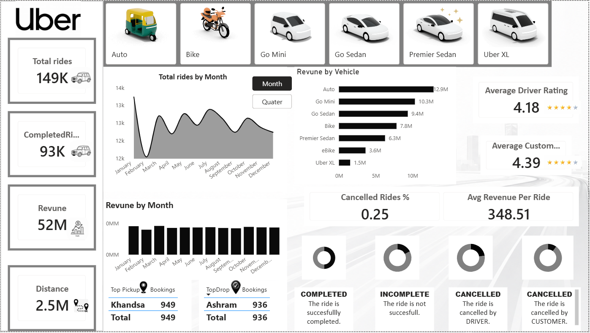

# Uber Trip Data Analysis

## Project Overview
This project analyzes Uber trip data to uncover trends in ride demand, booking patterns, trip purposes, and customer behavior. The analysis helps identify peak travel periods, popular trip categories, and operational insights that support data-driven transportation and business decisions.

---

## Business Problem
Uber generates large volumes of trip data daily, making it difficult to manually identify customer travel patterns and operational trends. The objective of this project is to transform raw trip data into actionable insights through data analysis and visualization.

---

## Objectives
- Analyze trip frequency and travel trends
- Identify peak booking periods
- Understand trip purposes and categories
- Track distance and trip distribution
- Generate operational and business insights

---

## Tools & Technologies Used
- Microsoft Excel / Power BI
- Pivot Tables
- Pivot Charts
- Data Cleaning
- Slicers & Filters
- KPI Cards

---

## Dataset Information
- Uber trip dataset containing:
  - Trip Date & Time
  - Start Location
  - End Location
  - Trip Category
  - Purpose
  - Distance Covered

---

## KPIs Tracked
- Total Trips
- Total Distance Covered
- Average Trip Distance
- Peak Booking Hours
- Most Frequent Trip Category

---

## Key Insights

### Trip Demand Analysis
- Trip bookings were highest during weekday business hours, indicating strong demand for work-related travel.
- Ride frequency increased significantly during evening hours and weekends.

### Distance Analysis
- Most trips covered short-to-medium distances, suggesting high usage for local transportation.
- A smaller number of long-distance trips contributed significantly to total travel distance.

### Category & Purpose Analysis
- Business trips accounted for the majority of rides.
- Meetings, office visits, and customer-related travel were among the most common trip purposes.

### Time-Based Trends
- Peak ride demand was observed during morning and evening commuting hours.
- Monthly trends indicated fluctuations in ride activity based on seasonal and work patterns.

---

## Business Recommendations
- Increase driver availability during peak commuting hours to reduce ride wait times.
- Optimize pricing strategies during high-demand periods.
- Improve route optimization for frequently traveled locations.
- Focus operational planning around business travel demand patterns.

---

## Dashboard Preview

---

## Conclusion
This project provides an interactive analysis of Uber trip data, helping identify customer travel behavior, operational demand trends, and business opportunities through data visualization and KPI tracking.
